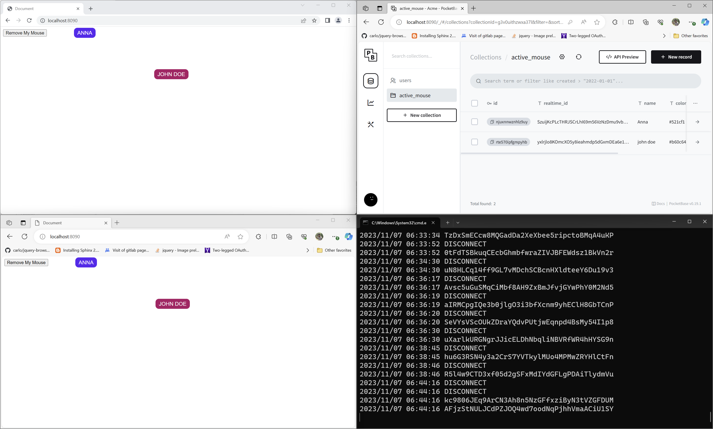

# Pocketbase Mouse Tracker

This is a sample demo application to try out Pocketbase realtime database feature.

It works by utilizing:

1. The realtime clientId value when you subscribe for realtime update
2. A collection named `active_mouse` with the columns of `name`, `realtime_id`, `pos_x`, `pos_y`
3. The `onRealtimeDisconnectRequest` hook in the `main.pb.js` file in the `/pb_hooks` folder

## Installation

* Download this project, either by ZIP download or clone
* Keep everything neatly in a folder
* Get your own `pocketbase` executable for your OS at https://pocketbase.io/docs/
* Keep your `pocketbase` executable in the same folder as this `README.md` file
* Open up your terminal and run `pocketbase serve`
* Open `http://localhost:8090/_/` in your browser to create your admin user
* Open `http://localhost:8090` in your browser to run the demo

The content of `/pb_migrations` will automatically create the `active_mouse` collection.

<a href="https://youtu.be/zAlWP5ofmiA
" target="_blank">**YouTube Video**</a> (https://youtu.be/zAlWP5ofmiA)